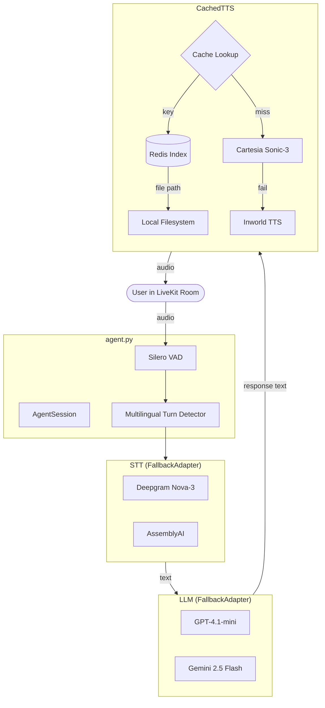
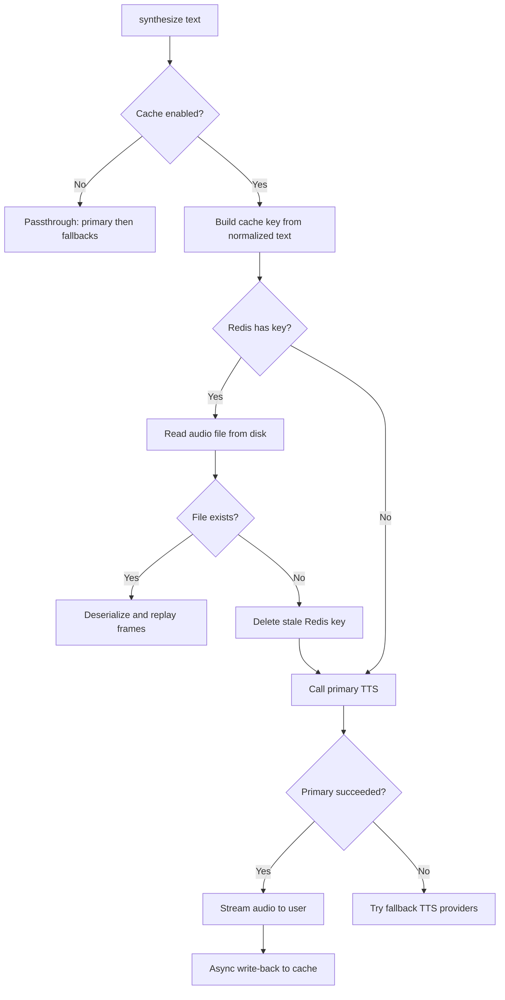

# LiveKit Voice Agent with Cached TTS

A real-time voice agent built on [LiveKit Agents](https://docs.livekit.io/agents/) with a two-tier TTS caching layer that avoids redundant synthesis API calls.

## How It Works

The agent joins a LiveKit room, listens to the user via STT, generates a response with an LLM, and speaks it back with TTS. Each component has a fallback chain so the agent stays responsive even if a provider goes down.

### Architecture



### TTS Caching Flow

On every `synthesize()` call, `CachedTTS` checks Redis for a cached result before hitting the TTS provider:



**Cache key** format: `tts:{version}:{model}:{voice}:{sample_rate}:{sha1(normalized_text)}`

Text normalization (lowercase, strip punctuation, collapse whitespace) means `"Hello, World!"` and `"hello world"` hit the same cache entry.

**Two-tier storage:**
- **Redis** -- fast index mapping cache keys to file paths, configured with LFU eviction (`allkeys-lfu`, 512MB cap)
- **Local filesystem** -- audio blobs serialized with msgpack, stored under `.tts_cache/{version}/{model}/{voice}/{sample_rate}/{hash}.msgpack`

### Project Structure

```
.
├── agent.py              # LiveKit AgentServer, session wiring, metrics
├── adapter_factory.py    # Builds STT, LLM, TTS with fallback chains
├── cache_store.py        # CacheStore protocol + LocalCacheStore impl
├── cached_tts/           # TTS caching package
│   ├── __init__.py       # Re-exports
│   ├── core.py           # CachedTTS class (Redis, cache read/write, cleanup)
│   ├── streams.py        # ChunkedStream subclasses (dispatcher, passthrough)
│   ├── keys.py           # Text normalization + cache key builder
│   └── serialization.py  # msgpack serialize/deserialize
├── docker-compose.yml    # Redis 7 service
├── redis.conf            # LFU eviction config
└── tests/                # pytest suite (32 tests)
```

## Prerequisites

- Python >= 3.13
- [uv](https://docs.astral.sh/uv/) package manager
- Docker (for Redis)
- A [LiveKit Cloud](https://cloud.livekit.io/) account (or self-hosted LiveKit server)
- API keys for at least one provider in each category (STT, LLM, TTS)

## Local Setup

### 1. Install dependencies

```bash
uv sync
```

### 2. Configure environment

```bash
cp .env.example .env
```

Fill in the values:

| Variable | Description |
|---|---|
| `LIVEKIT_URL` | Your LiveKit server URL |
| `LIVEKIT_API_KEY` | LiveKit API key |
| `LIVEKIT_API_SECRET` | LiveKit API secret |
| `REDIS_URL` | Redis connection string (default: `redis://localhost:6379/1`) |
| `CACHED_TTS_ENABLED` | Toggle caching on/off (default: `true`) |
| `CACHED_TTS_TTL_DAYS` | Cache entry lifetime (default: `30`) |
| `CACHED_TTS_STORAGE_DIR` | Audio file storage directory (default: `.tts_cache`) |

### 3. Start Redis

```bash
docker compose up -d
```

This starts Redis 7 with LFU eviction policy configured via `redis.conf`.

### 4. Download model weights

One-time download for Silero VAD and the turn detector:

```bash
uv run agent.py download-files
```

### 5. Run the agent

**Dev mode** (connects to LiveKit Cloud with hot reload):

```bash
uv run agent.py dev
```

**Console mode** (local mic/speaker, no LiveKit room):

```bash
uv run agent.py console
```

## Running Tests

```bash
uv run pytest -v
```

Tests use `fakeredis` and `tmp_path` fixtures -- no running Redis or LiveKit server needed.